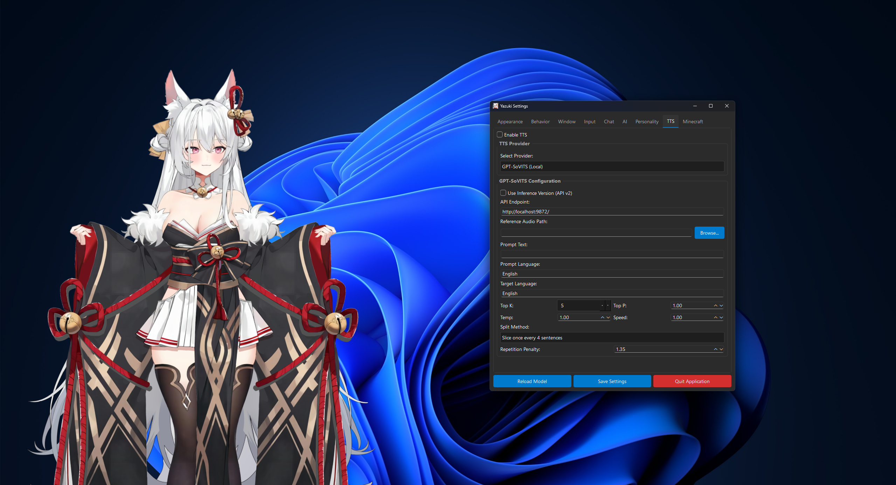
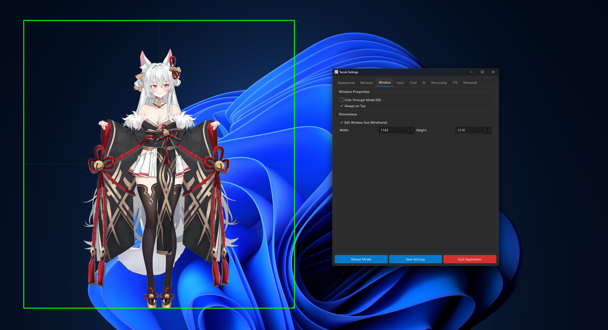

# Yazuki - AI Desktop Companion

<p float="left">
  
   
</p>

<video src="resources/media/yazukivid.mp4" controls title="Yazuki Demo" width="100%"></video>

Yazuki is a fully customizable, Python-based desktop companion that renders a Live2D Cubism model directly on your desktop. She lives in a transparent, always-on-top window and can interact with you via voice, text, and eye tracking.

This project emphasizes **privacy and local control**, offering full support for local AI (Ollama), local Speech-to-Text (Whisper), and local Text-to-Speech (GPT-SoVITS), while still supporting cloud providers like OpenAI and Typecast.ai.

## ✨ Key Features

*   **🖥️ Live2D Rendering**: Renders Cubism 3.0+ models with transparency.
*   **🧠 AI Intelligence**:
    *   **Ollama (Local)**: Run models like Llama 3, Mistral, or Gemma locally.
    *   **OpenAI (Cloud)**: Use GPT-4o or GPT-3.5 Turbo.
*   **🗣️ Voice Interaction**:
    *   **Speech-to-Text**: Local `openai-whisper` (free/private) or OpenAI Whisper API.
    *   **Text-to-Speech**: Local **GPT-SoVITS** (high quality custom voices) or **Typecast.ai**.
    *   **Lip Sync**: Real-time mouth movement synchronized with the character's voice.
*   **👀 Interactive**:
    *   **Eye Tracking**: The character follows your mouse cursor.
    *   **Click-Through**: Toggle "ghost mode" to click through the character to windows behind her.
*   **⚙️ Modern Settings UI**:
    *   Configure everything in real-time without restarting.
    *   Adjust model scale, position, and sensitivity.
    *   Customize chat bubble appearance (font, colors, opacity).
*   **🎤 Push-to-Talk**: Hold a key (default 'V') to speak to your companion.

---

## 🛠️ Prerequisites

Before installing, ensure you have the following:

1.  **Python 3.10+** installed.
2.  **FFmpeg**: Required for audio processing (Whisper/TTS).
    *   [Download FFmpeg](https://ffmpeg.org/download.html) and ensure it is added to your System PATH.
3.  **Live2D Model**: You need a folder containing a Live2D model (`.model3.json`, textures, etc.).
    *   *Note: A free model is provided, and that's Yazuki!*

### Optional (For Local AI/TTS)
4.  **Ollama**: For local chat intelligence.
    *   [Download Ollama](https://ollama.com/).
    *   Run `ollama pull llama3` (or your preferred model).
5.  **GPT-SoVITS**: For local, high-quality voice cloning.
    *   [GPT-SoVITS Repository](https://github.com/RVC-Boss/GPT-SoVITS).
    *   You must run the API server (usually on port `9872` or `9880`).

---

## 📦 Installation

1.  **Clone the Repository**
    ```bash
    git clone https://github.com/Matthew-IE/yazuki.git
    cd yazuki
    ```

2.  **Install Dependencies**
    ```bash
    pip install -r requirements.txt
    ```

3.  **Install Live2D Bindings**
    This project uses `live2d-py`.
    ```bash
    pip install live2d-py
    ```
    *If a pre-built wheel is not available for your OS/Python version, you may need to build it from source or use the "Mock Mode" (green square) included in the app.*

4.  **Add Your Model**
    *   Copy your Live2D model folder into `resources/model/`.
    *   Example structure: `resources/model/my_character/my_character.model3.json`

5.  **Configure Model Path**
    *   Open `config.json` and update `"model_folder"` to point to your model's directory.
    ```json
    "model_folder": "resources/model/my_character",
    ```

---

## 🚀 How to Run

Start the application:

```bash
python -m app.main
```

---

## ⚙️ Configuration Guide

Access the **Settings** by right-clicking the system tray icon.

### 1. AI Provider (Chat)
*   **Ollama (Default)**:
    *   Ensure Ollama is running.
    *   **Endpoint**: `http://localhost:11434/api/chat`
    *   **Model**: Enter the model name you pulled (e.g., `llama3`).
*   **OpenAI**:
    *   Enter your API Key.
    *   Select Model (e.g., `gpt-5-nano`).

### 2. Text-to-Speech (Voice)
*   **GPT-SoVITS (Local)**:
    *   Run your GPT-SoVITS API server.
    *   **Endpoint**: `http://localhost:9872/` (or your port).
    *   **Reference Audio**: Browse for a `.wav` file of the voice you want to clone (3-10s).
    *   **Prompt Text**: Type exactly what is said in the reference audio.
    *   **Languages**: Set Prompt and Target languages (e.g., `English`).
*   **Typecast.ai (Cloud)**:
    *   Requires an API Key and Voice ID from Typecast.

### 3. Voice Input (STT)
*   **Local Whisper**: Automatically used if no OpenAI key is provided. Downloads the `small` model on first use.
*   **OpenAI Whisper**: Used if an OpenAI API key is present.

### 4. Behavior & Appearance
*   **Lip Sync**: Adjust the "Mouth Sensitivity" slider if the mouth opens too much or too little during speech.
*   **Eye Tracking**: Toggle "Look at Mouse" and adjust sensitivity.
*   **Window**: Use "Edit Window Size" to resize the container if your model is cut off.

---

## 🎮 Controls

| Key / Action | Function |
| :--- | :--- |
| **Hold 'V'** | **Push-to-Talk**. Speak while holding, release to send. |
| **F8** | **Toggle Click-Through**. <br>ON: Click through the character.<br>OFF: Drag character to move. |
| **F9** | **Reload Model**. Useful if physics glitch or to apply config changes. |
| **Tray Icon** | Right-click for Menu (Settings, Quit). |
| **ESC** | Quit Application (Only if model is selected and click through is off). |

---


## 🗣️ Typecast.ai Setup (TTS)

<details>
<summary>Click to expand setup instructions</summary>

To enable voice responses, this project uses [Typecast.ai](https://typecast.ai/).

1.  **Sign Up**: Create an account at [Typecast.ai](https://typecast.ai/).
2.  **Free Credits**: New users typically receive **30,000 characters** of free synthesis credits per month.
3.  **Get API Key**: Go to your Dashboard or Developer settings to generate an API Key.
4.  **Get Voice ID**: Browse the [Voices](https://typecast.ai/docs/voices) catalog to find a Voice ID (e.g., `tc_...`).
5.  **Configure**: Enter these details in the **TTS** tab of the Settings window.

</details>

---

## ❓ Troubleshooting

*   **"Live2D library not found"**: The app will run in "Mock Mode" (rotating square). Ensure `live2d-py` is installed correctly for your Python version.
*   **"No audio recorded"**: Check the "Input" tab in Settings and select the correct microphone.
*   **GPT-SoVITS Error**: Ensure the API server is running and the "Reference Audio Path" points to a valid file on your disk.
*   **Ollama Error**: Ensure `ollama serve` is running and you have pulled the model specified in settings.

---

## ⚙️ Normal Json Config

```json
{
    "model_folder": "resources/model/live2d/yazuki",
    "window": {
        "width": 800,
        "height": 1000,
        "x": 100,
        "y": 100,
        "always_on_top": true,
        "click_through": false
    },
    "render": {
        "scale": 1.0,
        "fps": 60,
        "offset_x": 0.0,
        "offset_y": 0.0,
        "sensitivity": 0.35,
        "look_at_mouse": true
    },
    "chat": {
        "font_size": 16,
        "text_color": "#FFFFFF",
        "bg_color": "#000000",
        "bg_opacity": 180,
        "offset_x": 0,
        "offset_y": 0
    },
    "ai": {
        "provider": "ollama",
        "enabled": false,
        "api_key": "",
        "input_device": -1,
        "input_key_vk": 86,
        "input_key_name": "V",
        "memory_enabled": false
    },
    "typecast": {
        "enabled": false,
        "api_key": "",
        "voice_id": "tc_62a8975e695ad26f7fb514d1"
    },
    "tts": {
        "provider": "gpt_sovits"
    },
    "gpt_sovits": {
        "endpoint": "http://localhost:9872/",
        "ref_audio_path": "",
        "prompt_text": "",
        "prompt_lang": "English",
        "text_lang": "English"
    }
}
```

## ⚙️ Troubleshooting

- **"Live2D library not found"**: Ensure `live2d-py` is installed in your current Python environment. The app will run in "Mock Mode" (green square) if it's missing.
- **Black/White Background**: The app requests an OpenGL context with an alpha channel. If you see a solid background, ensure your graphics drivers are up to date.
- **Model not loading**: Check the terminal output. Ensure `model_folder` in `config.json` points to the folder containing the `.model3.json` file.
