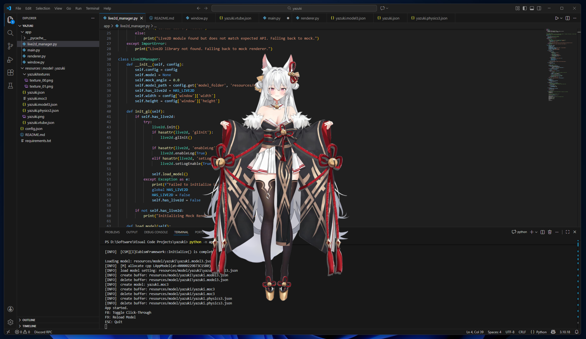

# Yazuki - Live2D Desktop Companion



A Python-based desktop companion that renders a Live2D Cubism model in a transparent, always-on-top window. It allows you to have a virtual character on your screen that you can interact with or click through while working.

## Features

- **Transparent Window**: Borderless and transparent background (only the character is visible).
- **Always-on-Top**: Stays above other windows.
- **System Tray Control**: A system tray icon allows you to control the app even when the window is in click-through mode.
- **Click-Through Toggle**: Press `F8` or use the tray menu to toggle between interacting with the model (drag to move) and clicking through it.
- **Live2D Rendering**: Supports Live2D Cubism models via `live2d-py`.
- **Mock Mode**: If the Live2D library is missing, it gracefully falls back to a "Mock Mode" (rotating green square) for testing window behavior.

## Requirements

- Windows 10/11
- Python 3.8+
- A Live2D Cubism Model (Exported for runtime, version 3.0+)

## Installation

1.  **Clone the repository**:
    ```bash
    git clone https://github.com/Matthew-IE/yazuki.git
    cd yazuki
    ```

2.  **Install Python Dependencies**:
    ```bash
    pip install -r requirements.txt
    ```

3.  **Install Live2D Bindings**:
    This project relies on `live2d-py` for rendering.
    ```bash
    pip install live2d-py
    ```
    *Note: If `pip install live2d-py` fails or isn't available for your platform, check [live2d-py on GitHub](https://github.com/EasyLive2D/live2d-py) for build instructions or pre-built wheels.*

4.  **Add Your Model**:
    - Place your exported Live2D model folder inside `resources/model/`.
    - Update `config.json` to point to your specific model folder.
    - Example `config.json`:
      ```json
      {
          "model_folder": "resources/model/my_character_folder",
          ...
      }
      ```

## How to Run

Run the application from the project root:

```bash
python -m app.main
```

## Controls

- **System Tray Icon**: Right-click the icon in your taskbar to access the menu (Settings, Toggle Click-Through, Reload, Quit).
- **Settings Window**: Accessible from the tray menu, allows real-time adjustment of scale, positioning, click-through, and always-on-top behavior.
- **Left Click + Drag**: Move the character (only works when Click-Through is **OFF**).
- **F8**: Toggle Click-Through Mode.
  - **OFF**: You can click and drag the character.
  - **ON**: Clicks pass through the character to windows behind it.
- **F9**: Reload the model (useful for quick iteration).
- **ESC**: Quit the application.

## Configuration

You can customize the application by editing `config.json`:

```json
{
    "model_folder": "resources/model/yazuki",
    "window": {
        "width": 800,
        "height": 1000,
        "x": 100,
        "y": 100,
        "always_on_top": true,
        "click_through": false
    },
    "render": {
        "scale": 1.0,
        "fps": 60
    }
}
```

## Troubleshooting

- **"Live2D library not found"**: Ensure `live2d-py` is installed in your current Python environment. The app will run in "Mock Mode" (green square) if it's missing.
- **Black/White Background**: The app requests an OpenGL context with an alpha channel. If you see a solid background, ensure your graphics drivers are up to date.
- **Model not loading**: Check the terminal output. Ensure `model_folder` in `config.json` points to the folder containing the `.model3.json` file.
