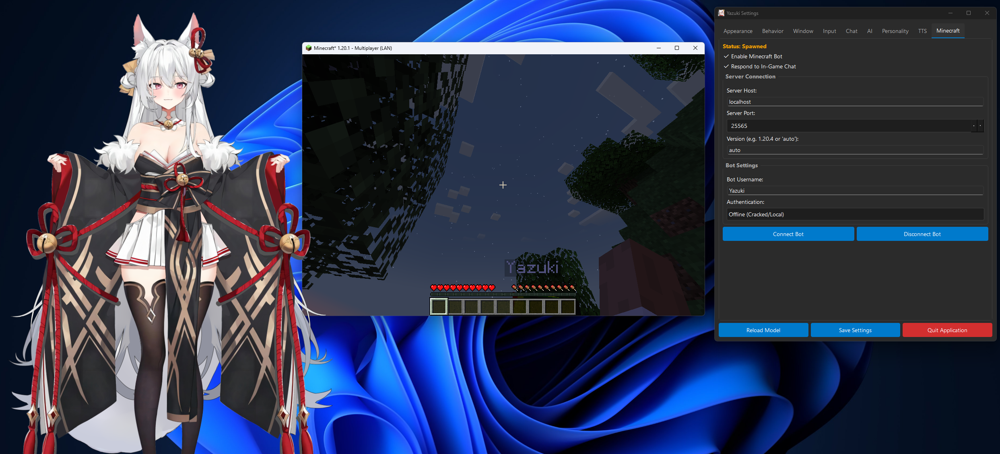

# Yazuki - AI Desktop Companion

<p float="left">
  
   
</p>

<video src="resources/media/yazukivid.mp4" controls title="Yazuki Demo" width="100%"></video>

Yazuki is a fully customizable, Python-based desktop companion that renders a Live2D Cubism model directly on your desktop. She lives in a transparent, always-on-top window and can interact with you via voice, text, and eye tracking.

This project emphasizes **privacy and local control**, offering full support for local AI (Ollama), local Speech-to-Text (Whisper), and local Text-to-Speech (GPT-SoVITS), while still supporting cloud providers like OpenAI, OpenRouter, ElevenLabs, and Typecast.ai.

##  Key Features

*   ** Live2D Rendering**: Renders Cubism 3.0+ models with transparency.
*   ** AI Intelligence**:
    *   **Ollama (Local)**: Run models like Llama 3, Mistral, or Gemma locally.
    *   **OpenAI (Cloud)**: Use GPT-4o or GPT-3.5 Turbo.
    *   **OpenRouter (Cloud)**: Access a wide range of models (Claude, Gemini, etc.) via OpenRouter.
*   ** Voice Interaction**:
    *   **Speech-to-Text**: Local `openai-whisper` (free/private) or OpenAI Whisper API.
    *   **Text-to-Speech**: 
        *   **GPT-SoVITS** (Local, high quality custom voices).
        *   **ElevenLabs** (Cloud, industry-leading realism).
        *   **Typecast.ai** (Cloud, diverse character voices).
    *   **Lip Sync**: Real-time mouth movement synchronized with the character's voice (supports both local and cloud audio).
*   ** Minecraft Integration**:
    *   **Bot Companion**: Yazuki can join your Minecraft server as a bot using Mineflayer.
    *   **Chat Bridge**: She reads in-game chat and responds intelligently.
    *   **Status Monitoring**: See connection status directly in the settings.
    *   **Bear in mind that the current implementation of Mineflayer is just bare bones.**
*   ** Interactive**:
    *   **Eye Tracking**: The character follows your mouse cursor.
    *   **Click-Through**: Toggle "ghost mode" to click through the character to windows behind her.
*   ** Modern Settings UI**:
    *   Configure everything in real-time without restarting.
    *   Adjust model scale, position, and sensitivity.
    *   Customize chat bubble appearance (font, colors, opacity).
*   ** Push-to-Talk**: Hold a key (default 'V') to speak to your companion.

---

##  Minecraft Integration

Yazuki can now join you in Minecraft!



*   **Connect**: Configure the server IP and port in the "Minecraft" settings tab.
*   **Chat**: Yazuki listens to the game chat. When other players speak, she processes the text and replies back in-game.
*   **Voice**: Her response is also spoken aloud on your desktop, creating a seamless bridge between the game and your companion.

---

##  Prerequisites

Before installing, ensure you have the following:

1.  **Python 3.10+** installed.
2.  **Node.js**: Required for the Minecraft bot integration.
    *   [Download Node.js](https://nodejs.org/).
3.  **FFmpeg**: Required for audio processing (Whisper/TTS).
    *   [Download FFmpeg](https://ffmpeg.org/download.html) and ensure it is added to your System PATH.
4.  **Live2D Model**: You need a folder containing a Live2D model (`.model3.json`, textures, etc.).
    *   *Note: A free model is provided, and that's Yazuki!*

### Optional (For Local AI/TTS)
5.  **Ollama**: For local chat intelligence.
    *   [Download Ollama](https://ollama.com/).
    *   Run `ollama pull llama3` (or your preferred model).
6.  **GPT-SoVITS**: For local, high-quality voice cloning.
    *   [GPT-SoVITS Repository](https://github.com/RVC-Boss/GPT-SoVITS).
    *   You must run the API server (usually on port `9872` or `9880`).

---

##  Installation

1.  **Clone the Repository**
    ```bash
    git clone https://github.com/Matthew-IE/yazuki.git
    cd yazuki
    ```

2.  **Install Python Dependencies**
    ```bash
    pip install -r requirements.txt
    ```

3.  **Install Node.js Dependencies (for Minecraft)**
    ```bash
    cd app/minecraft
    npm install
    cd ../..
    ```

4.  **Install Live2D Bindings**
    This project uses `live2d-py`.
    ```bash
    pip install live2d-py
    ```

5.  **Add Your Model**
    *   Copy your Live2D model folder into `resources/model/live2d`.
    *   Example structure: `resources/model/live2d/my_character/my_character.model3.json`

6.  **Configure Model Path**
    *   Open `config.json` and update `"model_folder"` to point to your model's directory.
    ```json
    "model_folder": "resources/model/my_character",
    ```

---

##  How to Run

Start the application:

```bash
python -m app.main
```

---

##  Configuration Guide

Access the **Settings** by right-clicking the system tray icon.

###  AI Settings
*   **Provider**: Choose between OpenAI, Ollama, or OpenRouter.
*   **System Prompt**: Define Yazuki's personality (e.g., "You are a tsundere anime girl...").
*   **Memory**: Enable/Disable conversation history.

###  TTS Settings
*   **Provider**: Select GPT-SoVITS, ElevenLabs, or Typecast.
*   **ElevenLabs**: Enter API Key and Voice ID. Supports "Flash" models for low latency.
*   **GPT-SoVITS**: Point to your local API endpoint.

###  Minecraft Settings
*   **Host/Port**: Server address (e.g., `localhost`, `25565`).
*   **Auth**: "Offline" (Cracked/Local) or "Microsoft" (Official).
*   **Bot Name**: The name Yazuki will use in-game.

###  Controls
*   **V (Hold)**: Push-to-Talk (Configurable).
*   **F8**: Toggle Click-Through Mode.
*   **F9**: Reload Model.
*   **Left Click + Drag**: Move the character (unless Click-Through is on).

---

##  Contributing

Contributions are welcome! Please feel free to submit a Pull Request.

